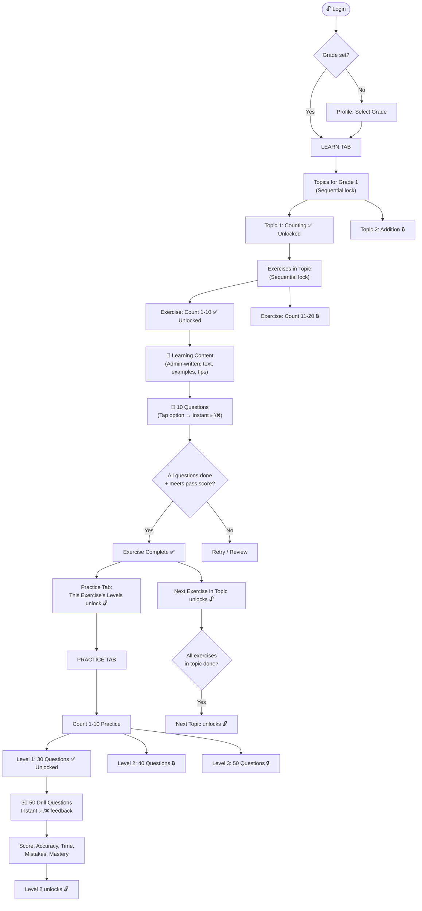
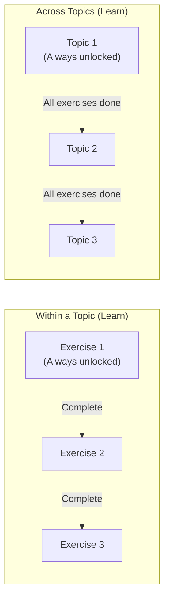
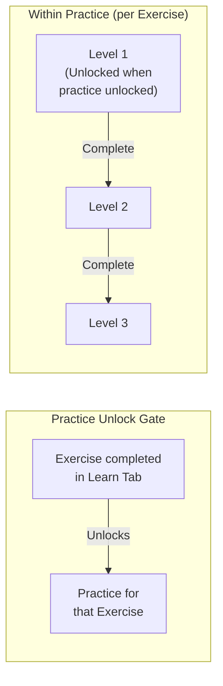
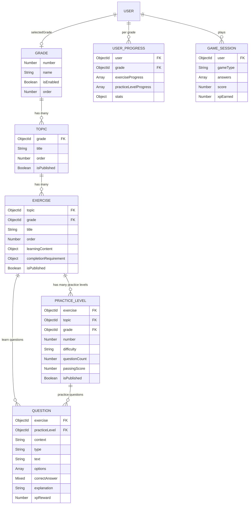
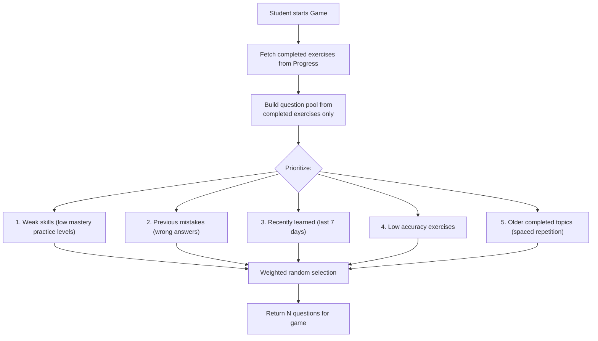

# 🎓 MathLearn — Complete System Design v3
**Corrected: Exercises in Learn • Levels in Practice**

---

## 1. Core Concept — Where Things Live

```
┌──────────────────────────────────────────────────────────────┐
│                                                              │
│   LEARN TAB                        PRACTICE TAB              │
│   ──────────                       ────────────              │
│                                                              │
│   Grade 1                          Grade 1                   │
│   ├── Topic: Counting              ├── Topic: Counting       │
│   │   ├── Exercise: Count 1-10     │   ├── Ex: Count 1-10   │
│   │   │   • Learning Content       │   │   ├── Level 1 (30Q) │
│   │   │   • 10 Questions           │   │   ├── Level 2 (40Q) │
│   │   │   • Complete ✅ → ──────── │── │── └── Level 3 (50Q) │
│   │   │                            │   │                     │
│   │   └── Exercise: Count 11-20    │   └── Ex: Count 11-20  │
│   │       • Learning Content       │       ├── Level 1       │
│   │       • 10 Questions           │       └── Level 2       │
│   │       • 🔒 (until above done)  │       🔒 (until done    │
│   │                                │          in Learn)      │
│   └── Topic: Addition              └── Topic: Addition       │
│       🔒 (until Counting done)         🔒                    │
│                                                              │
└──────────────────────────────────────────────────────────────┘
```

> [!IMPORTANT]
> - **Learn Tab** = Grade → Topic → Exercise (content + questions). **NO levels here.**
> - **Practice Tab** = Same Grade → Topic → Exercise structure, but each Exercise has **admin-created Levels** with 30-50 drill questions each.
> - Practice for an Exercise **only unlocks after completing that Exercise in Learn**.
> - Practice Levels are sequential: Level 1 → Level 2 → Level 3.

---

## 2. Complete User Flow



---

## 3. Locking Rules (Backend Enforced)

### Learn Tab Locking



### Practice Tab Locking



### Rules Summary

| # | Rule | Enforced By |
|:--|:---|:---|
| 1 | Topic 1 of a Grade is always unlocked | Backend |
| 2 | Exercise 1 of any unlocked Topic is always unlocked | Backend |
| 3 | Exercise N+1 unlocks when Exercise N is completed in Learn | Backend |
| 4 | Topic N+1 unlocks when ALL exercises in Topic N are completed | Backend |
| 5 | Practice for Exercise X unlocks when Exercise X is completed in Learn | Backend |
| 6 | Practice Level 1 is unlocked when Practice for that Exercise unlocks | Backend |
| 7 | Practice Level N+1 unlocks when Level N is completed | Backend |
| 8 | Users CANNOT access locked content via API requests | `lockGuard` middleware |
| 9 | Frontend only renders the state the backend returns | Frontend |

---

## 4. App Tabs (4 Tabs)

| # | Tab | Icon | What It Shows |
|:--|:---|:---|:---|
| 1 | **Practice** | `calculator` | Completed exercises with practice levels (30-50 Q each) |
| 2 | **Game** | `game-controller` | Recall/revision games using learned content |
| 3 | **Learning** | `book` | Grade → Topic → Exercise → Content + Questions |
| 4 | **Profile** | `person` | User info, stats, grade, full progress tree |

---

## 5. Screen Wireframes

### 5.1 Learn Tab — Topic List

```
┌──────────────────────────────────┐
│  Learning — Grade 1          📐  │
│  Master math step by step        │
├──────────────────────────────────┤
│                                  │
│  ████████░░░░ 35% Complete       │
│                                  │
│  ┌────────────────────────────┐  │
│  │ ✅ Counting                │  │
│  │    2/2 Exercises Done      │  │
│  │    [Review →]              │  │
│  └────────────────────────────┘  │
│                                  │
│  ┌────────────────────────────┐  │
│  │ 🔵 Addition                │  │
│  │    1/3 Exercises • Active  │  │
│  │    [Continue →]            │  │
│  └────────────────────────────┘  │
│                                  │
│  ┌────────────────────────────┐  │
│  │ 🔒 Subtraction             │  │
│  │    Complete Addition first  │  │
│  └────────────────────────────┘  │
│                                  │
└──────────────────────────────────┘
```

### 5.2 Learn Tab — Exercise List (tap a Topic)

```
┌──────────────────────────────────┐
│  ← Counting                 📊  │
├──────────────────────────────────┤
│                                  │
│  ┌────────────────────────────┐  │
│  │ ✅ Count 1-10              │  │
│  │    Completed • 90%         │  │
│  │    [Review →]              │  │
│  └────────────────────────────┘  │
│                                  │
│  ┌────────────────────────────┐  │
│  │ 🔵 Count 11-20             │  │
│  │    5/10 Questions Done     │  │
│  │    [Continue →]            │  │
│  └────────────────────────────┘  │
│                                  │
│  ┌────────────────────────────┐  │
│  │ 🔒 Count by 2s, 5s, 10s   │  │
│  │    Locked                   │  │
│  └────────────────────────────┘  │
│                                  │
└──────────────────────────────────┘
```

### 5.3 Learn Tab — Exercise Content + Questions (tap an Exercise)

```
┌──────────────────────────────────┐
│  ← Count 1-10                    │
├──────────────────────────────────┤
│                                  │
│  ╔════════════════════════════╗  │
│  ║  📖 Learning Content       ║  │
│  ║  ──────────────────        ║  │
│  ║  Numbers help us count     ║  │
│  ║  things around us!         ║  │
│  ║                            ║  │
│  ║  ┌─ Example ──────────┐   ║  │
│  ║  │ 🍎🍎🍎 = 3 apples  │   ║  │
│  ║  │ 🍎🍎🍎🍎🍎 = 5     │   ║  │
│  ║  └────────────────────┘   ║  │
│  ║                            ║  │
│  ║  💡 Tip: Use your fingers  ║  │
│  ║  to count along!           ║  │
│  ╚════════════════════════════╝  │
│                                  │
│  ╔════════════════════════════╗  │
│  ║  📝 Questions  (0/10)      ║  │
│  ║                            ║  │
│  ║  [ 🎯 Start Questions ]    ║  │
│  ╚════════════════════════════╝  │
│                                  │
└──────────────────────────────────┘
```

### 5.4 Learn Tab — Question Screen

```
┌──────────────────────────────────┐
│  ← Count 1-10         3/10  ⏱   │
├──────────────────────────────────┤
│  ████████░░░░░░ 30%              │
│                                  │
│  ┌────────────────────────────┐  │
│  │                            │  │
│  │   How many apples?         │  │
│  │   🍎🍎🍎🍎                 │  │
│  │                            │  │
│  │  ┌──────┐    ┌──────┐     │  │
│  │  │  3   │    │  4 ✅│     │  │
│  │  └──────┘    └──────┘     │  │
│  │  ┌──────┐    ┌──────┐     │  │
│  │  │  5   │    │  2   │     │  │
│  │  └──────┘    └──────┘     │  │
│  │                            │  │
│  │  ✅ Correct! +10 XP        │  │
│  │  There are 4 apples 🍎     │  │
│  │                            │  │
│  └────────────────────────────┘  │
│                                  │
│       [ Next Question → ]        │
└──────────────────────────────────┘
```

### 5.5 Practice Tab — Main Screen

```
┌──────────────────────────────────┐
│  Practice                    📊  │
│  Drill & master your skills      │
├──────────────────────────────────┤
│  ┌─── Stats ─────────────────┐   │
│  │ 💪 85%    🎯 342   🔥 12  │   │
│  │ Accuracy  Solved   Streak │   │
│  └────────────────────────────┘  │
│                                  │
│  ── Counting ──────────────────  │
│                                  │
│  ┌────────────────────────────┐  │
│  │ 📝 Count 1-10              │  │
│  │ ✅ Level 1 • 30Q • 93% 🏆 │  │
│  │ 🔵 Level 2 • 40Q • New!   │  │
│  │ 🔒 Level 3 • 50Q          │  │
│  └────────────────────────────┘  │
│  ┌────────────────────────────┐  │
│  │ 📝 Count 11-20             │  │
│  │ ✅ Level 1 • 30Q • 80%    │  │
│  │ 🔒 Level 2 • 40Q          │  │
│  └────────────────────────────┘  │
│                                  │
│  ── Addition ──────────────────  │
│                                  │
│  ┌────────────────────────────┐  │
│  │ 📝 Addition Within 10      │  │
│  │ 🔵 Level 1 • 30Q • New!   │  │
│  │ 🔒 Level 2 • 50Q          │  │
│  └────────────────────────────┘  │
│  ┌────────────────────────────┐  │
│  │ 🔒 Addition Within 20      │  │
│  │    Complete in Learning     │  │
│  └────────────────────────────┘  │
│                                  │
└──────────────────────────────────┘
```

### 5.6 Practice Tab — Drill Screen (tap a Level)

```
┌──────────────────────────────────┐
│  ← Count 1-10 • Level 2  8/40   │
├──────────────────────────────────┤
│  ████████████░░░ 20%             │
│                                  │
│  ┌────────────────────────────┐  │
│  │                            │  │
│  │   What number comes        │  │
│  │   after 7?                 │  │
│  │                            │  │
│  │  ┌──────┐    ┌──────┐     │  │
│  │  │  6   │    │  8 ✅│     │  │
│  │  └──────┘    └──────┘     │  │
│  │  ┌──────┐    ┌──────┐     │  │
│  │  │  9   │    │  10  │     │  │
│  │  └──────┘    └──────┘     │  │
│  │                            │  │
│  │  ✅ Correct! +5 XP         │  │
│  │                            │  │
│  └────────────────────────────┘  │
│                                  │
│       [ Next Question → ]        │
└──────────────────────────────────┘
```

### 5.7 Practice — Drill Result Summary

```
┌──────────────────────────────────┐
│        Level 2 Complete! 🎉      │
├──────────────────────────────────┤
│                                  │
│         🏆 Score: 85%            │
│                                  │
│  ┌────────────────────────────┐  │
│  │  ✅ Correct:    34/40      │  │
│  │  📊 Accuracy:   85%        │  │
│  │  ⏱️ Time:       4m 32s     │  │
│  │  ❌ Mistakes:   6          │  │
│  │  ⭐ XP Earned:  +170       │  │
│  │  🏅 Mastery:    82%        │  │
│  │  🏆 Best Score: 85% (New!) │  │
│  └────────────────────────────┘  │
│                                  │
│  Level 3 Unlocked! 🔓           │
│                                  │
│  [ Review Mistakes ]             │
│  [ Try Again ]                   │
│  [ Next Level → ]                │
│                                  │
└──────────────────────────────────┘
```

### 5.8 Game Tab

```
┌──────────────────────────────────┐
│  Games                       🎮  │
│  Recall & reinforce learning     │
├──────────────────────────────────┤
│                                  │
│  ┌─────────┐  ┌─────────┐       │
│  │ ⚡      │  │ 🔢      │       │
│  │ Quick   │  │ Number  │       │
│  │ Math    │  │ Match   │       │
│  └─────────┘  └─────────┘       │
│  ┌─────────┐  ┌─────────┐       │
│  │ 🎣      │  │ 🧠      │       │
│  │ Math    │  │ Memory  │       │
│  │ Catch   │  │ Math    │       │
│  └─────────┘  └─────────┘       │
│  ┌─────────┐  ┌─────────┐       │
│  │ 🔷      │  │ 🕐      │       │
│  │ Shape   │  │ Clock   │       │
│  │ Hunt    │  │ Chall.  │       │
│  └─────────┘  └─────────┘       │
│  ┌─────────┐  ┌─────────┐       │
│  │ 💰      │  │ 🔄      │       │
│  │ Money   │  │ Mixed   │       │
│  │ Game    │  │ Recall  │       │
│  └─────────┘  └─────────┘       │
│                                  │
│  Games use questions from        │
│  exercises you've completed ✅   │
└──────────────────────────────────┘
```

### 5.9 Profile Tab

```
┌──────────────────────────────────┐
│  Profile                     ⚙️  │
├──────────────────────────────────┤
│  ┌────────────────────────────┐  │
│  │  👤 Sunny Kumar            │  │
│  │  sunny@example.com         │  │
│  │  📐 Grade 1                │  │
│  │  [Change Grade ▼]          │  │
│  └────────────────────────────┘  │
│                                  │
│  ┌─── Statistics ─────────────┐  │
│  │ ❓ 342     📊 85%          │  │
│  │ Answered   Accuracy        │  │
│  │ ✅ 8       📚 3            │  │
│  │ Exercises  Topics          │  │
│  │ 🎮 28      ⭐ 1,240       │  │
│  │ Games      XP              │  │
│  │ 🔥 12      🏅 5           │  │
│  │ Streak     Prac. Levels    │  │
│  └────────────────────────────┘  │
│                                  │
│  ┌─── Progress ──────────────┐  │
│  │ 📐 Grade 1                │  │
│  │ ├── ✅ Counting            │  │
│  │ │   ├── ✅ Count 1-10      │  │
│  │ │   │   Practice: L1✅ L2✅ L3🔵│
│  │ │   └── ✅ Count 11-20     │  │
│  │ │       Practice: L1✅ L2🔒│  │
│  │ ├── 🔵 Addition            │  │
│  │ │   ├── ✅ Within 10       │  │
│  │ │   │   Practice: L1🔵 L2🔒│  │
│  │ │   └── 🔒 Within 20      │  │
│  │ └── 🔒 Subtraction         │  │
│  └────────────────────────────┘  │
│                                  │
│  ┌─── Menu ──────────────────┐  │
│  │  🔒 Change Password        │  │
│  │  📤 Share                   │  │
│  │  🚪 Sign Out                │  │
│  └────────────────────────────┘  │
└──────────────────────────────────┘
```

---

## 6. Backend Data Models (Separate Collections)

### 6.1 Grade Collection

```js
// Collection: grades
{
  _id: ObjectId,
  number: Number,            // 1, 2, 3, 4, 5
  name: String,              // "Grade 1"
  description: String,
  isEnabled: Boolean,        // Admin toggle
  icon: String,
  color: String,
  order: Number,
  createdBy: ObjectId,
  createdAt, updatedAt
}
```

### 6.2 Topic Collection

```js
// Collection: topics
{
  _id: ObjectId,
  grade: ObjectId,           // ref: Grade
  title: String,             // "Counting"
  description: String,
  icon: String,
  color: String,
  order: Number,             // Lock order within grade
  isPublished: Boolean,
  createdBy: ObjectId,
  createdAt, updatedAt
}
```

### 6.3 Exercise Collection

```js
// Collection: exercises
{
  _id: ObjectId,
  topic: ObjectId,           // ref: Topic
  grade: ObjectId,           // ref: Grade (denormalized)
  title: String,             // "Count 1-10"
  description: String,
  icon: String,
  color: String,
  order: Number,             // Lock order within topic
  isPublished: Boolean,

  // Learning content shown in Learn Tab
  learningContent: {
    blocks: [{
      type: String,          // 'text' | 'heading' | 'example' | 'tip' | 'image' | 'formula' | 'note'
      content: String,
      order: Number
    }]
  },

  // Completion requirement for Learn
  completionRequirement: {
    minScore: Number,        // Min % to pass (e.g., 80)
    mustAnswerAll: Boolean   // Must attempt all questions
  },

  createdBy: ObjectId,
  createdAt, updatedAt
}
```

### 6.4 Question Collection (Central Question Bank)

```js
// Collection: questions
{
  _id: ObjectId,
  
  // Where this question belongs
  exercise: ObjectId,        // ref: Exercise (for learn questions)
  practiceLevel: ObjectId,   // ref: PracticeLevel (for practice questions) — null if learn question
  grade: ObjectId,           // ref: Grade (denormalized)
  topic: ObjectId,           // ref: Topic (denormalized)

  context: String,           // 'learn' | 'practice'

  // Question content
  text: String,              // "What is 3 + 5?"
  type: String,              // 'mcq' | 'numeric' | 'fill_blank' | 'true_false' | 'matching' | 'ordering' | 'image_mcq'
  options: [String],         // For MCQ: ["6", "7", "8", "9"]
  correctAnswer: Mixed,      // String, Number, or Array
  matchPairs: [{             // For matching type
    left: String,
    right: String
  }],
  correctOrder: [String],    // For ordering type
  imageUrl: String,          // For image-based questions

  explanation: String,
  hint: String,
  difficulty: String,        // 'easy' | 'medium' | 'hard'
  xpReward: Number,
  order: Number,
  isPublished: Boolean,
  createdBy: ObjectId,
  createdAt, updatedAt
}
```

### 6.5 Practice Level Collection

```js
// Collection: practice_levels
{
  _id: ObjectId,
  exercise: ObjectId,        // ref: Exercise
  topic: ObjectId,           // ref: Topic (denormalized)
  grade: ObjectId,           // ref: Grade (denormalized)
  
  number: Number,            // 1, 2, 3... (admin decides how many)
  title: String,             // "Level 1" or custom name
  description: String,
  difficulty: String,        // 'easy' | 'medium' | 'hard'
  order: Number,             // Lock order within exercise's practice
  questionCount: Number,     // 30-50 (how many questions in this level)
  passingScore: Number,      // Min % to complete this level (e.g., 70)
  timeLimit: Number,         // Optional seconds (0 = no limit)
  isPublished: Boolean,
  createdBy: ObjectId,
  createdAt, updatedAt
}
```

### 6.6 User Progress Collection

```js
// Collection: user_progress
// One document per user per grade
{
  _id: ObjectId,
  user: ObjectId,            // ref: User
  grade: ObjectId,           // ref: Grade

  // Learn Progress
  exerciseProgress: [{
    exercise: ObjectId,      // ref: Exercise
    topic: ObjectId,         // ref: Topic
    status: String,          // 'locked' | 'unlocked' | 'in_progress' | 'completed'
    contentRead: Boolean,
    answers: [{
      question: ObjectId,
      userAnswer: Mixed,
      isCorrect: Boolean,
      timeSpentMs: Number,
      answeredAt: Date
    }],
    score: Number,           // % correct
    completedAt: Date
  }],

  // Practice Progress
  practiceLevelProgress: [{
    practiceLevel: ObjectId, // ref: PracticeLevel
    exercise: ObjectId,      // ref: Exercise (denormalized)
    topic: ObjectId,
    status: String,          // 'locked' | 'unlocked' | 'in_progress' | 'completed'
    attempts: [{
      answers: [{
        question: ObjectId,
        userAnswer: Mixed,
        isCorrect: Boolean,
        timeSpentMs: Number
      }],
      score: Number,
      totalCorrect: Number,
      totalQuestions: Number,
      accuracy: Number,
      totalTimeMs: Number,
      mistakes: [ObjectId],  // Question IDs answered wrong
      completedAt: Date
    }],
    bestScore: Number,
    mastery: Number,         // 0-100
    completed: Boolean,
    completedAt: Date
  }],

  // Aggregated stats
  stats: {
    totalQuestionsAnswered: Number,
    totalCorrectAnswers: Number,
    overallAccuracy: Number,
    exercisesCompleted: Number,
    topicsCompleted: Number,
    practiceLevelsCompleted: Number,
    gamesPlayed: Number,
    totalXp: Number,
    currentStreak: Number,
    longestStreak: Number,
    lastActiveDate: Date
  }
}
```

### 6.7 Game Session Collection

```js
// Collection: game_sessions
{
  _id: ObjectId,
  user: ObjectId,
  grade: ObjectId,
  gameType: String,          // 'quick_math' | 'number_match' | etc.
  questionsFrom: [{          // Which exercises questions came from
    exercise: ObjectId,
    topic: ObjectId
  }],
  answers: [{
    question: ObjectId,
    userAnswer: Mixed,
    isCorrect: Boolean,
    timeSpentMs: Number
  }],
  score: Number,
  totalCorrect: Number,
  totalQuestions: Number,
  accuracy: Number,
  totalTimeMs: Number,
  xpEarned: Number,
  completedAt: Date
}
```

### 6.8 User Model Update

```js
// Add to existing user.model.js
{
  // ... existing fields ...
  selectedGrade: {
    type: ObjectId,
    ref: 'Grade',
    default: null
  }
}
```

---

## 7. Complete API Contract

### 7.1 Curriculum Read APIs (Student)

```
# Grades
GET  /api/v1/grades                                → Enabled grades list
GET  /api/v1/grades/:gradeId                       → Grade detail

# Topics (with lock state from progress)
GET  /api/v1/grades/:gradeId/topics                → Topics + lock states

# Exercises (with lock state)
GET  /api/v1/topics/:topicId/exercises             → Exercises + lock states
GET  /api/v1/exercises/:exerciseId                 → Exercise detail + learning content
GET  /api/v1/exercises/:exerciseId/questions        → Learn questions (403 if locked)

# Practice Levels (with lock state)
GET  /api/v1/exercises/:exerciseId/practice-levels → Practice levels + lock states (403 if exercise not completed in learn)
GET  /api/v1/practice-levels/:levelId/questions    → Practice questions (403 if locked)
```

### 7.2 Progress APIs (Student)

```
# Read progress
GET   /api/v1/progress                             → Full progress tree for selected grade
GET   /api/v1/progress/stats                       → Aggregated stats only

# Learn actions
POST  /api/v1/progress/exercises/:exerciseId/answer → Submit answer to learn question
  Body: { questionId, answer }
  Response: { isCorrect, correctAnswer, explanation, xpEarned }
  ⛔ Returns 403 if exercise is locked.

POST  /api/v1/progress/exercises/:exerciseId/complete → Attempt to complete exercise
  Backend checks: Does score meet completionRequirement?
  If yes: marks complete, unlocks next exercise + practice levels
  If no: { success: false, reason: "Score 60% < required 80%" }

POST  /api/v1/progress/exercises/:exerciseId/read-content → Mark learning content as read

# Practice actions
POST  /api/v1/progress/practice-levels/:levelId/submit → Submit practice drill
  Body: { answers: [{ questionId, answer, timeSpentMs }] }
  Response: { score, totalCorrect, totalQuestions, accuracy, totalTimeMs,
              mistakes, xpEarned, mastery, bestScore, passed }
  ⛔ Returns 403 if practice level is locked.

# Game actions
POST  /api/v1/progress/games/session               → Submit game session results
```

### 7.3 Game APIs

```
GET   /api/v1/games/available                      → Available game types
POST  /api/v1/games/generate                       → Generate game questions
  Body: { gameType, questionCount }
  Backend pulls questions ONLY from completed exercises.
  Prioritizes: weak areas, mistakes, low mastery, recent content.
  Response: { gameSessionId, questions }
```

### 7.4 User APIs

```
PATCH /api/v1/users/select-grade                   → Select/change grade
  Body: { gradeId }
  Backend validates grade is enabled.
```

### 7.5 Admin APIs (All: `authenticate` + `authorize('admin')`)

```
# Grades
POST   /api/v1/admin/grades
PATCH  /api/v1/admin/grades/:id
PATCH  /api/v1/admin/grades/:id/toggle

# Topics
POST   /api/v1/admin/topics                        → { gradeId, title, order, ... }
PATCH  /api/v1/admin/topics/:id
DELETE /api/v1/admin/topics/:id
PATCH  /api/v1/admin/topics/:id/publish

# Exercises
POST   /api/v1/admin/exercises                     → { topicId, title, order, learningContent, ... }
PATCH  /api/v1/admin/exercises/:id
DELETE /api/v1/admin/exercises/:id
PATCH  /api/v1/admin/exercises/:id/publish
PUT    /api/v1/admin/exercises/:id/content          → Set learning content blocks
PUT    /api/v1/admin/exercises/:id/completion        → Set completion requirements

# Practice Levels (per exercise)
POST   /api/v1/admin/practice-levels               → { exerciseId, number, questionCount, ... }
PATCH  /api/v1/admin/practice-levels/:id
DELETE /api/v1/admin/practice-levels/:id
PATCH  /api/v1/admin/practice-levels/:id/publish

# Questions (learn + practice)
POST   /api/v1/admin/questions                     → { exerciseId OR practiceLevelId, context, type, ... }
PATCH  /api/v1/admin/questions/:id
DELETE /api/v1/admin/questions/:id
POST   /api/v1/admin/questions/bulk                → Bulk create
GET    /api/v1/admin/questions?exerciseId=&context= → List + filter

# Dashboard
GET    /api/v1/admin/dashboard
GET    /api/v1/admin/students
GET    /api/v1/admin/students/:id/progress
```

---

## 8. Backend Module Structure

```
backend/src/modules/
├── auth/                         (existing)
├── user/                         (existing — add selectedGrade)
│
├── curriculum/                   ★ NEW
│   ├── models/
│   │   ├── grade.model.js
│   │   ├── topic.model.js
│   │   ├── exercise.model.js
│   │   └── practiceLevel.model.js
│   ├── curriculum.controller.js  (Student read: grades, topics, exercises, levels)
│   ├── curriculum.service.js     (Fetch + compute lock states from progress)
│   ├── curriculum.routes.js
│   └── curriculum.validation.js
│
├── question/                     ★ NEW
│   ├── question.model.js
│   ├── question.controller.js
│   ├── question.service.js
│   ├── question.routes.js
│   └── question.validation.js
│
├── progress/                     ★ NEW
│   ├── progress.model.js
│   ├── progress.controller.js
│   ├── progress.service.js       (Lock validation, scoring, XP, unlock logic)
│   ├── progress.routes.js
│   └── progress.validation.js
│
├── game/                         ★ NEW
│   ├── gameSession.model.js
│   ├── game.controller.js
│   ├── game.service.js           (Smart question selection from learned content)
│   ├── game.routes.js
│   └── game.validation.js
│
├── admin/                        ★ NEW
│   ├── admin.controller.js
│   ├── admin.service.js
│   ├── admin.routes.js
│   └── admin.validation.js
│
└── math/                         (existing — replaced by curriculum)

middlewares/
├── lockGuard.middleware.js       ★ NEW — validates unlocked state before serving content
└── ... (existing)
```

---

## 9. Frontend Architecture

### 9.1 Route Structure

```
app/
├── (auth)/index.tsx                        — Welcome/Login/Register
├── (tabs)/
│   ├── _layout.tsx                         — 4-tab layout
│   ├── index.tsx                           — Practice (default tab)
│   ├── game.tsx                            — Game
│   ├── learn.tsx                           — Learning
│   └── profile.tsx                         — Profile
├── (learn)/                                — Stack screens for learn flow
│   ├── topic/[topicId].tsx                 — Exercise list for a topic
│   ├── exercise/[exerciseId].tsx           — Content + questions for exercise
│   └── exercise/[exerciseId]/questions.tsx — Question player
├── (practice)/
│   └── drill/[practiceLevelId].tsx         — Practice drill (30-50 questions)
├── (game)/
│   └── play/[gameType].tsx                 — Active game
└── _layout.tsx                             — Root with AuthProvider
```

### 9.2 Feature Modules

```
src/features/
├── learn/
│   ├── LearnScreen.tsx                     — Topic list for grade
│   ├── screens/
│   │   ├── ExerciseListScreen.tsx          — Exercises within a topic
│   │   ├── ExerciseDetailScreen.tsx        — Learning content + start questions
│   │   └── QuestionPlayerScreen.tsx        — Learn question player
│   ├── components/
│   │   ├── TopicCard.tsx                   — Topic (locked/unlocked/done)
│   │   ├── ExerciseCard.tsx                — Exercise row
│   │   ├── ContentBlockRenderer.tsx        — Renders learning content blocks
│   │   ├── QuestionPlayer.tsx              — Handles all 7 question types
│   │   ├── McqQuestion.tsx
│   │   ├── NumericQuestion.tsx
│   │   ├── FillBlankQuestion.tsx
│   │   ├── TrueFalseQuestion.tsx
│   │   ├── MatchingQuestion.tsx
│   │   ├── OrderingQuestion.tsx
│   │   ├── ImageQuestion.tsx
│   │   ├── QuestionFeedback.tsx            — ✅/❌ with explanation
│   │   └── ExerciseCompleteModal.tsx       — 🎉 Complete + unlocks
│   ├── hooks/
│   │   ├── useTopics.ts
│   │   ├── useExercises.ts
│   │   ├── useExerciseContent.ts
│   │   ├── useLearnQuestions.ts
│   │   └── useLearnProgress.ts
│   ├── services/
│   │   └── learnService.ts
│   └── types/learn.types.ts
│
├── practice/
│   ├── PracticeScreen.tsx                  — All unlocked exercises + levels
│   ├── screens/
│   │   └── DrillScreen.tsx                 — 30-50 question drill
│   ├── components/
│   │   ├── PracticeExerciseGroup.tsx       — Exercise card with levels inside
│   │   ├── PracticeLevelRow.tsx            — Level row (locked/unlocked/done + best score)
│   │   ├── DrillQuestionPlayer.tsx         — Practice question UI
│   │   └── DrillResultSummary.tsx          — Score, accuracy, time, mistakes, mastery
│   ├── hooks/
│   │   ├── usePracticeLevels.ts
│   │   ├── usePracticeQuestions.ts
│   │   └── useSubmitPractice.ts
│   └── services/practiceService.ts
│
├── game/
│   ├── GameScreen.tsx                      — Game type grid
│   ├── screens/
│   │   ├── QuickMathGame.tsx
│   │   ├── NumberMatchGame.tsx
│   │   ├── MathCatchGame.tsx
│   │   ├── MemoryMathGame.tsx
│   │   ├── ShapeHuntGame.tsx
│   │   ├── ClockChallengeGame.tsx
│   │   ├── MoneyGame.tsx
│   │   └── MixedRecallGame.tsx
│   ├── components/
│   │   ├── GameTypeCard.tsx
│   │   ├── GameTimer.tsx
│   │   ├── GameScoreBoard.tsx
│   │   └── GameResultScreen.tsx
│   ├── hooks/
│   │   ├── useGameGenerate.ts
│   │   └── useGameSubmit.ts
│   └── services/gameService.ts
│
├── profile/
│   ├── ProfileScreen.tsx
│   ├── components/
│   │   ├── ProfileHeaderCard.tsx
│   │   ├── ProfileStatsGrid.tsx            — 8 stat counters
│   │   ├── GradeSelector.tsx               — Grade picker modal
│   │   ├── ProgressTreeView.tsx            — Grade → Topic → Exercise → Practice Levels
│   │   ├── ProgressNodeItem.tsx            — ✅/🔵/🔒 status node
│   │   └── ProfileMenuSection.tsx
│   ├── hooks/
│   │   ├── useProfileData.ts
│   │   ├── useGrades.ts
│   │   └── useProgressTree.ts
│   └── services/profileService.ts
│
└── admin/
    ├── AdminDashboard.tsx
    ├── screens/
    │   ├── GradeManager.tsx
    │   ├── TopicManager.tsx
    │   ├── ExerciseManager.tsx             — Content editor + completion config
    │   ├── PracticeLevelManager.tsx         — Levels per exercise + config
    │   ├── QuestionManager.tsx             — Question bank (all 7 types)
    │   └── StudentProgressViewer.tsx
    └── services/adminService.ts
```

---

## 10. Database Relationship Diagram



---

## 11. Game Engine — Question Selection



**Rule**: Games NEVER introduce new concepts. All questions come from exercises the student has already completed in Learning.

---

## 12. Implementation Phases

### Phase 1: Backend Models + APIs (5-6 days)
- [ ] Grade, Topic, Exercise, PracticeLevel, Question models
- [ ] UserProgress model
- [ ] GameSession model
- [ ] `lockGuard` middleware — validate unlocked state, return 403 for locked content
- [ ] Student curriculum GET endpoints (with lock state computation)
- [ ] Progress mutation endpoints (answer, complete exercise, submit practice, game session)
- [ ] Admin CRUD endpoints for all entities
- [ ] Update User model with `selectedGrade`
- [ ] Seed Grade 1: 3 topics, 2-3 exercises each, 10 learn questions per exercise, 2-3 practice levels per exercise with 30 questions each
- [ ] Wire all routes in `app.js`
- [ ] Test all endpoints

### Phase 2: Frontend Learning Tab (4-5 days)
- [ ] API services: `learnService.ts`, `progressService.ts`
- [ ] Components: `TopicCard`, `ExerciseCard`, `ContentBlockRenderer`
- [ ] `QuestionPlayer` with all 7 question types
- [ ] `QuestionFeedback` (✅/❌ + explanation)
- [ ] `ExerciseCompleteModal` with unlock notifications
- [ ] React Query hooks for topics, exercises, questions, progress
- [ ] Stack navigation: Topics → Exercises → Content → Questions
- [ ] Rewrite `LearnScreen.tsx`

### Phase 3: Frontend Practice Tab (3-4 days)
- [ ] `PracticeExerciseGroup` (grouped by Topic → Exercise → Levels)
- [ ] `PracticeLevelRow` with lock states + best score
- [ ] `DrillScreen` for 30-50 question sessions
- [ ] `DrillResultSummary` (score, accuracy, time, mistakes, mastery)
- [ ] Rewrite `PracticeScreen.tsx`

### Phase 4: Frontend Profile + Grade (2-3 days)
- [ ] `GradeSelector` modal
- [ ] `ProfileStatsGrid` (8 stats)
- [ ] `ProgressTreeView` (Grade → Topic → Exercise → Practice Levels tree)
- [ ] Update AuthContext with selectedGrade
- [ ] Rewrite `ProfileScreen.tsx`

### Phase 5: Frontend Game Tab (5-6 days)
- [ ] `gameService.ts`
- [ ] Game selection screen (8 game cards)
- [ ] Implement 8 game screens
- [ ] Smart question selection from learned content
- [ ] `GameResultScreen`
- [ ] Rewrite `GameScreen.tsx`

### Phase 6: Admin Panel (5-6 days)
- [ ] Grade Manager
- [ ] Topic Manager
- [ ] Exercise Manager (content editor + completion config)
- [ ] Practice Level Manager
- [ ] Question Manager (all 7 types, learn vs practice)
- [ ] Student Progress Viewer
- [ ] Admin Dashboard

---

## 13. Supported Question Types

| Type | Value | Learn | Practice | Game | Input UI |
|:---|:---|:---:|:---:|:---:|:---|
| Multiple Choice | `mcq` | ✅ | ✅ | ✅ | 4 option buttons |
| Numeric Answer | `numeric` | ✅ | ✅ | ✅ | Number keypad |
| Fill in Blank | `fill_blank` | ✅ | ✅ | ✅ | Text input |
| True / False | `true_false` | ✅ | ✅ | ✅ | 2 buttons |
| Matching | `matching` | ❌ | ✅ | ✅ | Drag-to-match |
| Ordering | `ordering` | ❌ | ✅ | ✅ | Drag-to-reorder |
| Image-based | `image_mcq` | ✅ | ✅ | ✅ | Image + MCQ |

---

## 14. Key Design Principles

| Principle | How |
|:---|:---|
| **Backend = source of truth** | Lock states computed server-side. Frontend renders what API returns. |
| **No API bypass** | `lockGuard` middleware validates every content request against progress. |
| **Admin controls everything** | Grades, topics, exercises, practice levels, questions, difficulty, pass score, question count. |
| **Exercises complete in Learn** | Learning content + questions live in the Exercise. No levels in Learn. |
| **Practice levels per exercise** | After completing an Exercise in Learn, its Practice levels (admin-created) unlock in Practice tab. |
| **Separate collections** | Grades, Topics, Exercises, PracticeLevels, Questions, UserProgress — all independent. |
| **Grade-agnostic** | Works for Grade 1–5+ without code changes. Just add data. |
| **No user "Level"** | Progress shown per-topic, per-exercise, per-practice-level. No global user level. |
| **Smart games** | Only use learned content. Prioritize weak areas + mistakes. |
