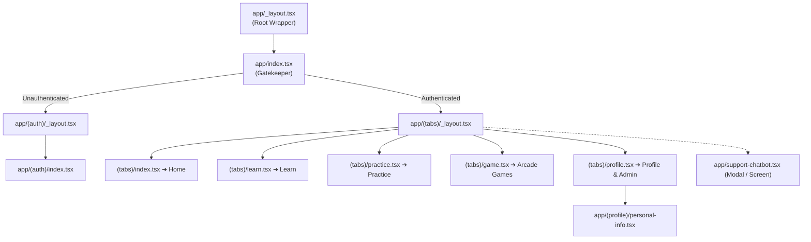

# 📱 MathMagic Mobile App (React Native & Expo)

> **Gamified, interactive Grade 1–5 Mathematics Learning App** built with **React Native**, **Expo SDK 52**, **Expo Router**, **NativeWind (Tailwind CSS)**, and **TanStack Query**.

---

## 📑 Table of Contents

1. [Overview & Highlights](#-overview--highlights)
2. [Tech Stack & Dependencies](#-tech-stack--dependencies)
3. [Architecture & Feature-Sliced Structure](#-architecture--feature-sliced-structure)
4. [Routing & Navigation Architecture](#-routing--navigation-architecture)
5. [Core Feature Domains](#-core-feature-domains)
   - [1. Authentication & Onboarding](#1-authentication--onboarding)
   - [2. Home Dashboard & Daily Missions](#2-home-dashboard--daily-missions)
   - [3. Curriculum & Learn Mode](#3-curriculum--learn-mode)
   - [4. Practice Drills & Custom Keypad](#4-practice-drills--custom-keypad)
   - [5. Speed Math Arcade Games](#5-speed-math-arcade-games)
   - [6. User Profile, Progress Tree & Admin CMS](#6-user-profile-progress-tree--admin-cms)
   - [7. Embedded AI Support Tutor](#7-embedded-ai-support-tutor)
6. [State Management & Networking](#-state-management--networking)
   - [TanStack React Query Patterns](#tanstack-react-query-patterns)
   - [Axios Refresh Token Interceptor](#axios-refresh-token-interceptor)
   - [SecureStore Encryption Layer](#securestore-encryption-layer)
7. [Theme Tokens & Design System](#-theme-tokens--design-system)
8. [Local Development & Setup](#-local-development--setup)
9. [Build & Release Guide (EAS)](#-build--release-guide-eas)

---

## 🌟 Overview & Highlights

MathMagic delivers an immersive mobile learning experience tailored for children, educators, and parents. It transforms abstract mathematical concepts into visual stories, responsive drills, and arcade games with instant feedback.

```
┌───────────────────────────────────────────────────────────┐
│                 MathMagic Mobile App                      │
└─────────────────────────────┬─────────────────────────────┘
                              │
  ┌──────────────┬────────────┼────────────┬─────────────┐
  ▼              ▼            ▼            ▼             ▼
┌──────────┐ ┌──────────┐ ┌──────────┐ ┌──────────┐ ┌──────────┐
│  Home    │ │  Learn   │ │ Practice │ │  Arcade  │ │ Profile  │
│Dashboard │ │  Engine  │ │  Drills  │ │  Games   │ │  & Tree  │
└──────────┘ └──────────┘ └──────────┘ └──────────┘ └──────────┘
```

### ✨ Mobile Capabilities
- **File-Based Routing via Expo Router**: Clean URL-like navigation with deep link handling.
- **Micro-Interactions & Haptics**: Smooth animations powered by `react-native-reanimated` and physical vibration feedback on success/failure via `expo-haptics`.
- **Custom In-App Keypad**: Big, child-friendly numeric input for lightning-fast arithmetic drills.
- **Offline-Resilient Auth**: Automatic token refresh rotation with Expo SecureStore persistence.
- **Real-time AI Chatbot**: Built-in interactive math tutor to assist students with step-by-step problem solving.
- **In-App Admin CMS**: Instant access for teachers/administrators to manage curriculum directly on mobile.

---

## 🛠️ Tech Stack & Dependencies

| Area | Package | Version | Purpose |
| :--- | :--- | :--- | :--- |
| **Core Framework** | `react-native` / `expo` | `0.76.7` / `~52.0.0` | Mobile application runtime |
| **Navigation** | `expo-router` | `~4.0.17` | Type-safe file-based router |
| **Styling** | `nativewind` / `tailwindcss` | `^4.0.1` / `^3.3.2` | Utility-first styling engine |
| **Server State** | `@tanstack/react-query` | `^5.66.9` | Caching, deduplication & sync |
| **HTTP Client** | `axios` | `^1.7.9` | Network communication & interceptors |
| **Secure Storage** | `expo-secure-store` | `~14.0.1` | Hardware-backed token encryption |
| **Animations** | `react-native-reanimated` | `~3.16.1` | Native thread UI animations |
| **OAuth** | `@react-native-google-signin` | `^13.1.0` | Google Sign-In SDK |
| **Sensory Feedback**| `expo-haptics` | `~14.0.1` | Tactile haptic triggers |
| **Visual Elements** | `expo-linear-gradient`, `react-native-svg` | `~14.0.1` / `15.8.0` | Glassmorphism, gradients & vector art |

---

## 📁 Architecture & Feature-Sliced Structure

```text
MathMagic/
├── app/                                 # Expo Router Navigation Layer
│   ├── (auth)/                          # Authentication group
│   │   ├── _layout.tsx                  # Auth stack navigator
│   │   └── index.tsx                    # -> Renders @features/auth/AuthScreen
│   ├── (profile)/                       # Profile child screens
│   │   └── personal-info.tsx            # Edit name, phone, change password
│   ├── (tabs)/                          # Main bottom tab navigator
│   │   ├── _layout.tsx                  # Tab bar layout (glass blur & icons)
│   │   ├── index.tsx                    # -> Renders @features/home/HomeScreen
│   │   ├── learn.tsx                    # -> Renders @features/learn/LearnScreen
│   │   ├── practice.tsx                 # -> Renders @features/practice/PracticeScreen
│   │   ├── game.tsx                     # -> Renders @features/game/GameScreen
│   │   └── profile.tsx                  # -> Renders @features/profile/ProfileScreen
│   ├── _layout.tsx                      # Root layout (AuthProvider, QueryClient)
│   ├── index.tsx                        # Splash gatekeeper (redirects to auth or tabs)
│   ├── oauth-native-callback.tsx        # Deep-link OAuth receiver
│   └── support-chatbot.tsx              # Standalone AI Support Tutor Screen
│
└── src/                                 # Feature-Sliced Application Core
    ├── api/                             # Network & API Integration
    │   ├── client.ts                    # Axios instance with refresh interceptor
    │   ├── config.ts                    # Dynamic IP/Platform host resolver
    │   ├── endpoints.ts                 # Centralized endpoint dictionary
    │   └── index.ts
    │
    ├── components/                      # Shared Global UI Primitives
    │   ├── common/
    │   │   ├── SafeScreen.tsx           # Notch & status bar safe area wrapper
    │   │   ├── LoadingState.tsx         # Branded loading spinner
    │   │   ├── ErrorState.tsx           # Error alert with retry button
    │   │   └── EmptyState.tsx           # Friendly empty list illustration
    │   └── index.ts
    │
    ├── constants/                       # Theme Tokens & System Constants
    │   └── index.ts                     # COLORS, STORAGE_KEYS, THEME
    │
    ├── context/                         # Application Contexts
    │   ├── AuthContext.tsx              # User state, login, logout, token hooks
    │   └── index.ts
    │
    ├── features/                        # Domain Feature Slices
    │   ├── auth/                        # 🔐 Auth Domain
    │   │   ├── components/              # AuthFormView, WelcomeView, BackgroundDecorations
    │   │   ├── hooks/                   # useAuthScreen form handler
    │   │   ├── services/                # authService (Login, Register, Google OAuth)
    │   │   └── AuthScreen.tsx
    │   │
    │   ├── home/                        # 🏠 Home Dashboard
    │   │   ├── components/              # HomeHeader, DailyMissionsCard, ContinueLearningCard,
    │   │   │                            # MathFactCard, WeeklyActivityCard, QuickShortcutsGrid
    │   │   ├── hooks/                   # useHomeDashboard
    │   │   └── HomeScreen.tsx
    │   │
    │   ├── learn/                       # 📖 Curriculum & Learning
    │   │   ├── components/              # TopicCard, ExerciseCard, ExerciseDetailModal,
    │   │   │                            # ContentBlockRenderer, QuestionPlayer, QuestionFeedback,
    │   │   │                            # ExerciseCompleteModal
    │   │   ├── hooks/                   # useCurriculumData
    │   │   └── LearnScreen.tsx
    │   │
    │   ├── practice/                    # 🧮 Practice Drills
    │   │   ├── components/              # TopicSelector, PracticeExerciseGroup, PracticeLevelRow,
    │   │   │                            # DrillSessionModal, DrillQuestionPlayer, DrillResultSummary,
    │   │   │                            # PracticeStatsHeader
    │   │   ├── hooks/                   # usePracticeSession
    │   │   └── PracticeScreen.tsx
    │   │
    │   ├── game/                        # ⚡ Arcade Games
    │   │   ├── components/              # GameCard, ActiveGameRunnerModal, GameCountdown,
    │   │   │                            # GameHUD, GamePlayingView, GameOverModal, GameResultModal,
    │   │   │                            # games/ (QuickMath, NumberMatch, MemoryMath, MathCatch, MixedRecall)
    │   │   ├── hooks/                   # useMathGame
    │   │   └── GameScreen.tsx
    │   │
    │   └── profile/                     # 👤 User Profile & Admin
    │       ├── components/              # ProfileHeaderCard, ProfileStatsGrid, ProfileStatsRow,
    │       │                            # ProfileMenuSection, GradeSelectorCard, GradePickerModal,
    │       │                            # ProgressTreeView, AdminEntryButton, AdminPortalModal
    │       ├── hooks/                   # useProfileData
    │       └── ProfileScreen.tsx
    │
    ├── hooks/                           # Shared Global Hooks
    │   └── useHapticFeedback.ts         # Cross-platform haptics
    │
    ├── services/                        # Native Services
    │   ├── tokenStorage.ts              # SecureStore JWT manager
    │   └── statsStorage.ts              # SecureStore offline stats
    │
    └── types/                           # Global Type Definitions
        └── index.ts                     # UserProfile, Question, Lesson, ProgressTree types
```

---

## 🧭 Routing & Navigation Architecture

Expo Router provides file-based routing with full type safety:



---

## 🎯 Core Feature Domains

### 1. Authentication & Onboarding
- **Clean Split View**: Toggle between *Sign In*, *Create Account*, and *Forgot Password*.
- **Google One-Tap**: Seamless sign-in with Google OAuth.
- **Deep-Link Password Reset**: Handles `mathmagic://reset-password?token=...` automatically.

### 2. Home Dashboard & Daily Missions
- **Personalized Header**: Displays current student avatar, XP balance, and active daily streak flame.
- **Daily Missions**: 3 daily objectives with interactive **Claim** buttons that award XP directly.
- **Continue Learning**: Smart shortcut leading directly to the student's next unfinished subtopic.
- **Math Fact of the Day**: Curated daily mathematical trivia to inspire curiosity.
- **Weekly Activity Chart**: Visual bar graph summarizing daily question volume.

### 3. Curriculum & Learn Mode
- **Hierarchical Navigation**: Select a Topic ➔ View Subtopic Exercises ➔ Open Lesson Reader.
- **Dynamic Content Blocks**: Renders headings, explanatory text, mathematical formulas, example boxes, and visual tips.
- **Interactive Checkpoint Quizzes**: Embedded questions that validate understanding before marking the subtopic as completed.
- **Celebration Modal**: Animated completion dialogue awarding XP and unlocking subsequent topics.

### 4. Practice Drills & Custom Keypad
- **Progressive Difficulty Levels**: Level 1 (Beginner) through Level 5 (Advanced) per exercise.
- **Drill Engine**: Rapid-fire question sessions (30-50 questions) with live score counters.
- **Custom Numeric Keypad**: Oversized buttons, haptic feedback, and instant validation.
- **Post-Drill Summary**: Accuracy breakdown, speed analytics, mastery percentage calculation, and an itemized mistake review list.

### 5. Speed Math Arcade Games
- **5 Built-In Game Modes**:
  1. ⚡ **Quick Math**: Rapid arithmetic blitz under dynamic countdown pressure.
  2. 🧩 **Number Match**: Pair mathematical expressions with their evaluated results.
  3. 🧠 **Memory Math**: Card-flip memory matching game for arithmetic facts.
  4. 🍎 **Math Catch**: Catch the correct falling number before it hits the ground.
  5. 🔄 **Mixed Recall**: Rapidly alternating operators and question types.
- **Combo Engine**: Success streaks build combo multipliers up to 3x.
- **Star Rating System**: Scores award 1, 2, or 3 stars based on performance benchmarks.

### 6. User Profile, Progress Tree & Admin CMS
- **XP Level Computation**: Level formula `Level = Math.floor(xp / 100) + 1` with an animated progress bar to the next level.
- **Grade Picker**: Modal to switch active grade curriculum (Grade 1 through 5).
- **Progress Tree Visualizer**: Visual breakdown of mastery percentages across all topics and exercises.
- **In-App Admin CMS**: Gated for users with the `admin` role, providing full mobile management of Grades, Topics, Exercises, Practice Levels, Question Bank (7 types), and Student analytics.

### 7. Embedded AI Support Tutor (`support-chatbot.tsx`)
- Full-screen conversational AI interface.
- Quick prompt buttons (*"How do I practice addition?"*, *"Explain fractions"*, *"What is a streak?"*).
- Markdown response renderer for mathematical formulas and bullet points.

---

## ⚡ State Management & Networking

### TanStack React Query Patterns
All remote server data is cached and synchronized using React Query:

```typescript
// Example: Fetching Home Dashboard with automated caching
export const useHomeDashboard = () => {
  return useQuery({
    queryKey: ['home-dashboard'],
    queryFn: async () => {
      const response = await apiClient.get<ApiResponse<HomeDashboardData>>(
        ENDPOINTS.PROGRESS.HOME_DASHBOARD
      );
      return response.data.data;
    },
    staleTime: 1000 * 60 * 2, // 2 minutes
  });
};
```

### Axios Refresh Token Interceptor
`src/api/client.ts` implements a resilient queue-based refresh mechanism:

1. Inbound 401 responses trigger the interceptor.
2. The failing request is queued while a refresh request is dispatched to `/api/v1/auth/refresh`.
3. Upon receiving new tokens, the tokens are saved to SecureStore, and queued requests are retried with the new `Bearer` header.
4. If refresh fails, the session is invalidated and the user is redirected to the Auth screen.

### SecureStore Encryption Layer
- `tokenStorage.ts`: Persists `accessToken` and `refreshToken` in device secure hardware storage.
- `statsStorage.ts`: Provides local offline caching for XP and streaks.

---

## 🎨 Theme Tokens & Design System

Defined in `src/constants/index.ts` and `tailwind.config.js`:

```typescript
export const COLORS = {
  primary: '#6366F1',    // Indigo Accent
  secondary: '#EC4899',  // Pink Glow
  success: '#10B981',    // Emerald Green
  warning: '#F59E0B',    // Amber Gold
  danger: '#EF4444',     // Crimson Red
  darkBg: '#0F172A',     // Slate Dark Background
  cardBg: '#1E293B',     // Slate Dark Surface
  textPrimary: '#F8FAFC',
  textSecondary: '#94A3B8',
};
```

---

## 🚀 Local Development & Setup

### 📋 Prerequisites
- **Node.js**: `v18+`
- **Expo Go App** (installed on your iOS or Android physical device) or an active Emulator

---

### Step 1: Install Dependencies
```bash
cd MathMagic
npm install
```

### Step 2: Configure Environment (`.env`)
Create a `.env` file in the `MathMagic/` root:
```env
# Point to your development computer's local IP address and backend port
EXPO_PUBLIC_API_URL=http://192.168.1.100:5000/api/v1
EXPO_PUBLIC_GOOGLE_WEB_CLIENT_ID=your_google_web_client_id.apps.googleusercontent.com
```

### Step 3: Start Expo Server
```bash
npx expo start
```

- Press `a` to open in Android Emulator.
- Press `i` to open in iOS Simulator.
- Press `w` to open in Web Browser.
- Scan QR code with Expo Go on a physical phone.

---

## 📦 Build & Release Guide (EAS)

MathMagic is configured for **Expo Application Services (EAS Build)**:

```bash
# 1. Install EAS CLI
npm install -g eas-cli

# 2. Log in to Expo account
eas login

# 3. Configure project
eas build:configure

# 4. Build APK for Android Testing
eas build -p android --profile preview

# 5. Build Production Binaries
eas build -p android --profile production
eas build -p ios --profile production
```

---

<div align="center">
  <sub>MathMagic Mobile • Designed with ❤️ for Joyful Learning</sub>
</div>
