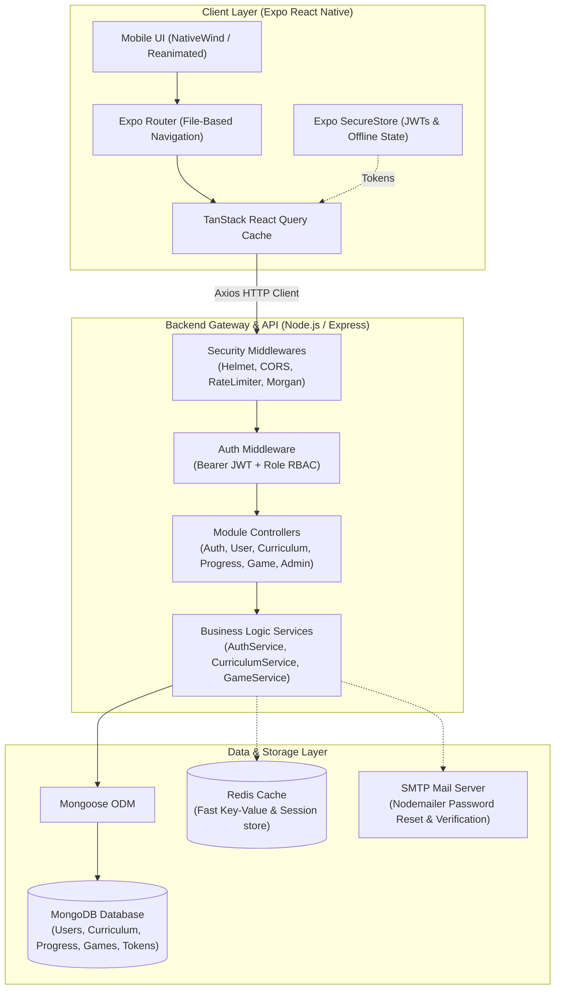
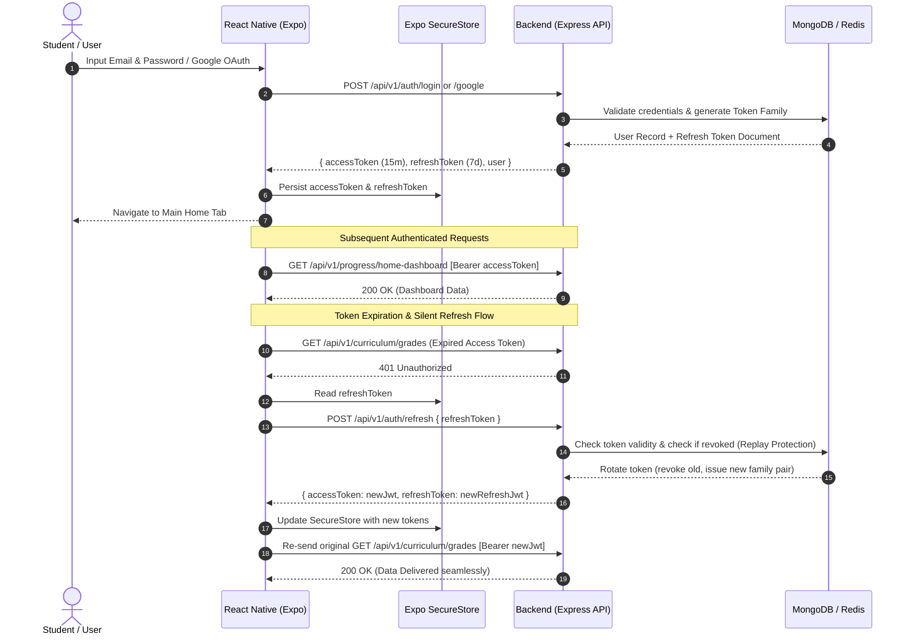
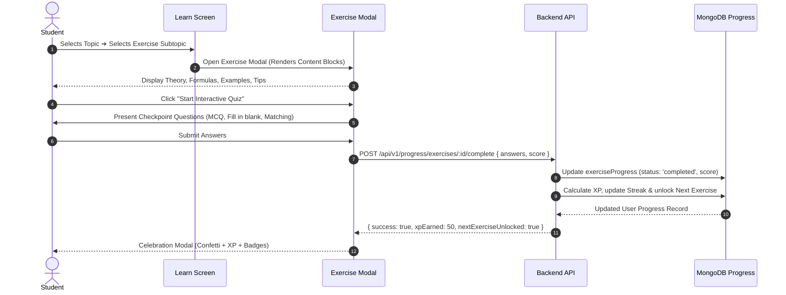
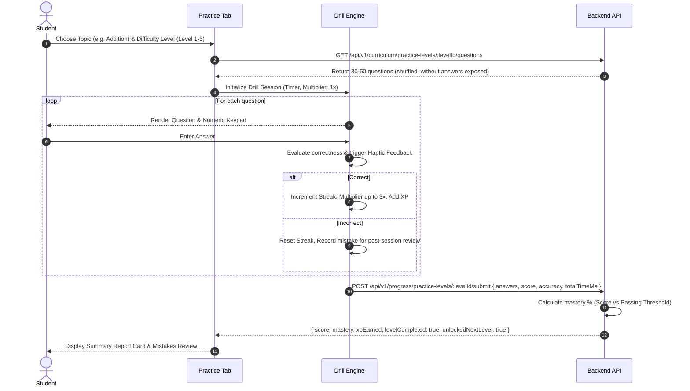
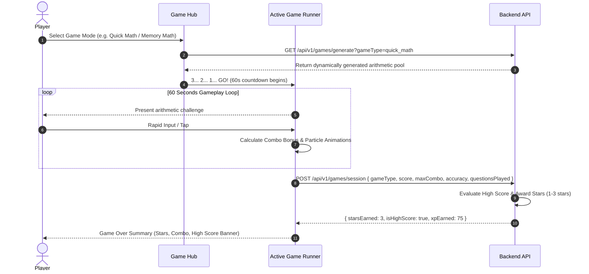
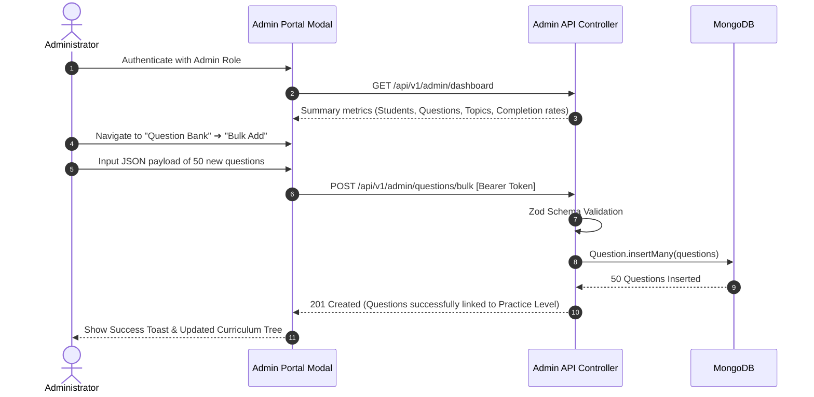

# 🌟 MathMagic Platform — Complete Ecosystem Documentation

> **An interactive, gamified, curriculum-driven Mathematics Learning Platform** powered by a **React Native (Expo SDK 52)** mobile application and an enterprise-ready **Node.js / Express / MongoDB / Redis** backend API.

---

## 📑 Table of Contents

1. [Platform Overview & Key Highlights](#-platform-overview--key-highlights)
2. [System Architecture & High-Level Design](#-system-architecture--high-level-design)
3. [Core Feature Matrix](#-core-feature-matrix)
4. [Database Design & Entity Relationship Diagram (ERD)](#-database-design--entity-relationship-diagram-erd)
5. [End-to-End System Workflows](#-end-to-end-system-workflows)
   - [Authentication & Token Rotation Flow](#1-authentication--token-rotation-flow)
   - [Learning & Exercise Completion Flow](#2-learning--exercise-completion-flow)
   - [Practice Drill & Mastery Progression Flow](#3-practice-drill--mastery-progression-flow)
   - [Game Engine & Scoring Session Flow](#4-game-engine--scoring-session-flow)
   - [Admin Curriculum Management Flow](#5-admin-curriculum-management-flow)
6. [Repository & Directory Structure](#-repository--directory-structure)
7. [Technology Stack Matrix](#-technology-stack-matrix)
8. [Security & Production Hardening](#-security--production-hardening)
9. [Quick Start & Local Development Setup](#-quick-start--local-development-setup)
10. [Sub-Module Documentation Links](#-sub-module-documentation-links)

---

## 🎯 Platform Overview & Key Highlights

**MathMagic** transforms foundational mathematics education (Grades 1 through 5) into an engaging, gamified adventure. Built mobile-first for iOS, Android, and Web, the ecosystem connects students, parents, teachers, and curriculum administrators in a unified real-time learning loop.

```
       ┌────────────────────────────────────────────────────────┐
       │                 MathMagic Ecosystem                    │
       └───────────────────────────┬────────────────────────────┘
                                   │
         ┌─────────────────────────┴─────────────────────────┐
         ▼                                                   ▼
┌──────────────────┐                               ┌──────────────────┐
│  Mobile App      │                               │  REST API Server │
│  (React Native)  │ ◄─────── JSON REST ─────────► │  (Express/Node)  │
│  - Expo SDK 52   │           Bearer JWT          │  - MongoDB Atlas │
│  - NativeWind v4 │                               │  - Redis Cache   │
│  - TanStack v5   │                               │  - Winston/Zod   │
└──────────────────┘                               └──────────────────┘
```

### ✨ Key Platform Capabilities
- **Hierarchical Curriculum Engine**: Structured from `Grades` ➔ `Topics` ➔ `Exercises / Subtopics` ➔ `Practice Levels` ➔ `Questions`.
- **Dual Learning Paradigms**:
  - **Learn Mode**: Concept walkthroughs, step-by-step interactive content blocks (theory, formulas, examples, tips), and embedded checkpoint quizzes.
  - **Practice Mode**: Multi-tier drill sessions (Beginner to Advanced), instant validation, mistake review, and mastery metrics.
- **Speed Math & Arcade Games**: 5 real-time mini-games (*Quick Math*, *Number Match*, *Memory Math*, *Math Catch*, *Mixed Recall*) with combo multipliers, 3-star ratings, and high-score boards.
- **Gamification & Habit Building**: Daily XP goals, streak tracking with flame indicators, daily missions with claimable rewards, level rank escalations, and math facts of the day.
- **Embedded AI Support Tutor**: Interactive conversational math assistant with quick-prompt shortcuts, contextual math explanations, and platform guidance.
- **Admin Portal & CMS**: In-app administrative dashboard to manage curriculum structures, bulk-create questions across 7 question types, publish grades, and inspect student learning analytics.
- **Enterprise Security**: JWT authentication with Refresh Token Rotation, replay attack detection, bcrypt password hashing, Google OAuth, dynamic CORS, rate limiting, and input sanitization via Zod.

---

## 🏗️ System Architecture & High-Level Design

The platform uses a layered client-server architecture designed for high availability, low latency, and offline resilience.



---

## 🧩 Core Feature Matrix

| Feature Domain | Capabilities | Client Screens | Backend Modules |
| :--- | :--- | :--- | :--- |
| **Authentication** | Email/Password, Google OAuth, Token Rotation, Password Reset via Deep Linking, Session Revocation | `(auth)/index.tsx`, `oauth-native-callback.tsx` | `modules/auth`, `modules/user` |
| **Home Dashboard** | Daily Missions, Streak Indicator, Math Fact of the Day, Weekly Activity Tracker, Continue Learning shortcut | `(tabs)/index.tsx`, `HomeScreen.tsx` | `modules/progress`, `modules/user` |
| **Learn Engine** | Topic intro summaries, content blocks (headings, formulas, examples, tips, images), step-by-step checkpoint questions | `(tabs)/learn.tsx`, `LearnScreen.tsx`, `ExerciseDetailModal.tsx` | `modules/curriculum`, `modules/progress` |
| **Practice Drills** | 3-5 Level progressive difficulty, 30-50 question drills, custom keypad, mistake tracking, accuracy & speed breakdown | `(tabs)/practice.tsx`, `PracticeScreen.tsx`, `DrillSessionModal.tsx` | `modules/curriculum`, `modules/progress`, `modules/question` |
| **Arcade Games** | 5 Mini-games, combo streaks, dynamic countdown timers, star grading (1-3 stars), personal best records | `(tabs)/game.tsx`, `GameScreen.tsx`, `ActiveGameRunnerModal.tsx` | `modules/game` |
| **AI Support Bot** | Interactive math tutoring chatbot, canned guidance queries, markdown response formatting | `app/support-chatbot.tsx` | Frontend rule-based AI engine & endpoints |
| **User Profile & Tree**| XP level computation (`Level = floor(XP/100)+1`), Grade picker, personal details, progress tree breakdown | `(tabs)/profile.tsx`, `(profile)/personal-info.tsx` | `modules/user`, `modules/progress` |
| **Admin Portal** | Grade/Topic/Exercise CRUD, Level Config, Question Bank (7 types), Bulk importer, Student performance audit | `ProfileScreen.tsx` (Admin Modal) | `modules/admin` |

---

## 🗄️ Database Design & Entity Relationship Diagram (ERD)

The MongoDB database is organized around 8 primary schemas, optimized with compound indexes for high-throughput queries.

```mermaid
erDiagram
    USER ||--o{ REFRESH_TOKEN : "owns"
    USER ||--o{ USER_PROGRESS : "tracks"
    USER ||--o{ GAME_SESSION : "plays"
    USER }o--o| GRADE : "selectedGrade"

    GRADE ||--o{ TOPIC : "contains"
    TOPIC ||--o{ EXERCISE : "contains"
    EXERCISE ||--o{ PRACTICE_LEVEL : "contains"
    EXERCISE ||--o{ QUESTION : "has (learn context)"
    PRACTICE_LEVEL ||--o{ QUESTION : "has (practice context)"

    USER {
        ObjectId _id PK
        string name
        string email UK
        string password "hashed (select: false)"
        string role "student | parent | teacher | admin"
        string authProvider "local | google | apple"
        string googleId "sparse index"
        string referralCode UK
        ObjectId selectedGrade FK
        number xp
        number streak
        boolean isActive
        boolean isEmailVerified
        date createdAt
        date updatedAt
    }

    REFRESH_TOKEN {
        ObjectId _id PK
        string tokenHash INDEX
        ObjectId user FK
        date expiresAt "TTL index"
        string deviceInfo
        string ipAddress
        boolean revoked
        string replacedByTokenHash
    }

    GRADE {
        ObjectId _id PK
        number number UK
        string name
        string description
        boolean isEnabled
        string icon
        string color
        number order
    }

    TOPIC {
        ObjectId _id PK
        ObjectId grade FK
        string title
        string description
        object introduction "summary, videoUrl, keyTakeaways, blocks[]"
        string icon
        string color
        number order
        boolean isPublished
    }

    EXERCISE {
        ObjectId _id PK
        ObjectId topic FK
        ObjectId grade FK
        number subtopicNumber
        string title
        string description
        object learningContent "summary, blocks[]"
        object completionRequirement "minScore, mustAnswerAll"
        number order
        boolean isPublished
    }

    PRACTICE_LEVEL {
        ObjectId _id PK
        ObjectId exercise FK
        ObjectId topic FK
        ObjectId grade FK
        number number
        string title
        string difficulty "beginner | easy | medium | hard | advanced"
        number questionCount "default: 30"
        number passingScore "default: 70"
        number timeLimit
        number order
        boolean isPublished
    }

    QUESTION {
        ObjectId _id PK
        string context "learn | practice"
        ObjectId exercise FK
        ObjectId practiceLevel FK
        ObjectId topic FK
        ObjectId grade FK
        string type "mcq | numeric | fill_blank | true_false | matching | ordering | image_mcq"
        string text
        array options
        mixed correctAnswer
        array acceptableAnswers
        array matchPairs
        array correctOrder
        string imageUrl
        string explanation
        string hint
        string difficulty
        number xpReward
        number order
    }

    USER_PROGRESS {
        ObjectId _id PK
        ObjectId user FK
        ObjectId grade FK
        array exerciseProgress "exercise, topic, status, score, answers[]"
        array practiceLevelProgress "practiceLevel, exercise, topic, status, bestScore, mastery, attempts[]"
        object stats "totalQuestionsAnswered, totalCorrect, accuracy, xp, streak"
    }

    GAME_SESSION {
        ObjectId _id PK
        ObjectId user FK
        ObjectId grade FK
        string gameType "quick_math | number_match | memory_math | math_catch | mixed_recall"
        number score
        number accuracy
        number maxCombo
        number totalTimeMs
        number xpEarned
        number starsEarned "0 to 3"
        boolean isHighScore
        array questionsPlayed
        date completedAt
    }
```

---

## 🔄 End-to-End System Workflows

### 1. Authentication & Token Rotation Flow



---

### 2. Learning & Exercise Completion Flow



---

### 3. Practice Drill & Mastery Progression Flow



---

### 4. Game Engine & Scoring Session Flow



---

### 5. Admin Curriculum Management Flow



---

## 📁 Repository & Directory Structure

```text
MathMagic/
│
├── MathMagic/                           # React Native Mobile Application (Expo SDK 52)
│   ├── app/                             # Expo Router File-Based Routing System
│   │   ├── (auth)/                      # Authentication Stack (Login / Signup)
│   │   ├── (profile)/                   # Nested Profile Stack (Personal Info)
│   │   ├── (tabs)/                      # Main Bottom Tab Navigator (Home, Learn, Practice, Game, Profile)
│   │   ├── _layout.tsx                  # Root Layout (QueryClient, AuthProvider, Theme)
│   │   ├── index.tsx                    # Initial Routing Gatekeeper / Splash Screen
│   │   ├── oauth-native-callback.tsx    # Native OAuth Redirect Handler
│   │   └── support-chatbot.tsx          # Standalone AI Support Tutor Screen
│   │
│   ├── src/                             # Clean Feature-Sliced Source Code
│   │   ├── api/                         # Axios client, endpoints dictionary, token interceptors
│   │   ├── components/                  # Global shared UI primitives (SafeScreen, States, Cards)
│   │   ├── constants/                   # Theme tokens, Colors, Storage Keys
│   │   ├── context/                     # Global React Contexts (AuthContext)
│   │   ├── features/                    # Modular Feature Slices
│   │   │   ├── auth/                    # Auth forms, Google Sign-in hooks & services
│   │   │   ├── home/                    # Dashboard cards, Daily missions, Math fact
│   │   │   ├── learn/                   # Topic cards, Exercise reader, Content block parser
│   │   │   ├── practice/                # Drill sessions, Custom numeric keypad, Stats
│   │   │   ├── game/                    # 5 Mini-games, Countdown, Combo HUD, Leaderboards
│   │   │   └── profile/                 # Profile card, Progress tree, Admin portal modal
│   │   ├── hooks/                       # Shared custom hooks (haptics, responsiveness)
│   │   ├── services/                    # SecureStore token storage & offline stats
│   │   └── types/                       # Shared TypeScript interfaces & models
│   │
│   ├── app.json                         # Expo configuration (bundle ID, deep schemes)
│   ├── eas.json                         # EAS Build & Submit configurations
│   ├── tailwind.config.js               # NativeWind Tailwind CSS theme configuration
│   └── package.json                     # Frontend dependencies
│
├── backend/                             # Node.js / Express REST API Server
│   ├── src/
│   │   ├── app.js                       # Express application bootstrap & route mounting
│   │   ├── config/                      # Environment variables, MongoDB & Redis connectors
│   │   ├── constants/                   # System roles, status enums, game constants
│   │   ├── middlewares/                 # Auth, RBAC, Zod validation, RateLimit, Errors
│   │   ├── modules/                     # Domain Feature Modules
│   │   │   ├── admin/                   # Admin dashboard, curriculum builder & question manager
│   │   │   ├── auth/                    # JWT Auth, Google verification, password reset
│   │   │   ├── curriculum/              # Grades, Topics, Exercises, Practice Levels
│   │   │   ├── game/                    # Real-time game generation & session recorder
│   │   │   ├── math/                    # Standalone Grade 1 curriculum helpers
│   │   │   ├── progress/                # Progress tree, home dashboard, daily missions
│   │   │   ├── question/                # Question repository & CRUD
│   │   │   └── user/                    # User profile, role assignments, grade selector
│   │   ├── scripts/                     # Automated DB Seeding & Testing Scripts
│   │   │   ├── seedCurriculum.js        # Seeds Grades 1-5 & core topic hierarchies
│   │   │   ├── seedGrade1Batch1.js      # Seeds 100+ Grade 1 questions
│   │   │   ├── seedGrade1Batch2.js      # Seeds advanced practice drills
│   │   │   └── seedGrade1Batch3.js      # Seeds visual matching & ordering questions
│   │   └── utils/                       # ApiError, ApiResponse, Logger, Mailer, JWT helpers
│   │
│   ├── server.js                        # HTTP server listener & graceful shutdown handlers
│   └── package.json                     # Backend dependencies & scripts
│
└── README.md                            # Master Ecosystem Documentation (This file)
```

---

## 💻 Technology Stack Matrix

| Area | Technology | Version | Purpose |
| :--- | :--- | :--- | :--- |
| **Mobile Framework** | [React Native](https://reactnative.dev/) | `0.76.7` | Cross-platform native mobile foundation |
| **Mobile Toolchain** | [Expo SDK](https://expo.dev/) | `^52.0.0` | Managed workflow, native modules, OTA updates |
| **Routing** | [Expo Router](https://docs.expo.dev/router/) | `~4.0.17` | Type-safe, file-based stack & tab routing |
| **Styling** | [NativeWind](https://www.nativewind.dev/) | `^4.0.1` | Tailwind CSS for native components |
| **Data Fetching** | [TanStack React Query](https://tanstack.com/query) | `^5.66.9` | Caching, deduplication, optimistic updates |
| **Networking** | [Axios](https://axios-http.com/) | `^1.7.9` | HTTP client with automatic Refresh Token interceptor |
| **Mobile Security** | [Expo SecureStore](https://docs.expo.dev/versions/latest/sdk/securestore/) | `~14.0.1` | Encrypted key-value storage for tokens |
| **Backend Runtime** | [Node.js](https://nodejs.org/) | `>= 18.x` | High-performance asynchronous JavaScript engine |
| **API Framework** | [Express.js](https://expressjs.com/) | `^4.21.2` | Robust HTTP REST API server |
| **Database** | [MongoDB](https://www.mongodb.com/) / [Mongoose](https://mongoosejs.com/) | `^8.13.0` | Flexible document database with schema validation |
| **In-Memory Cache** | [Redis](https://redis.io/) / [ioredis](https://github.com/redis/ioredis) | `^5.6.1` | Fast session storage with offline fallback |
| **Authentication** | [jsonwebtoken](https://github.com/auth0/node-jsonwebtoken) | `^9.0.2` | Access + Refresh Token rotation engine |
| **Validation** | [Zod](https://zod.dev/) | `^3.24.2` | Runtime request body and parameter schema validation |
| **Logging** | [Winston](https://github.com/winstonjs/winston) / [Morgan](https://github.com/expressjs/morgan) | `^3.17.0` | Colorized development & structured JSON production logs |

---

## 🔒 Security & Production Hardening

1. **Token Family & Replay Attack Defense**:
   - Refresh tokens are stored as single-use records in MongoDB with automatic TTL expiry.
   - When a refresh token is reused after being rotated, the system flags a **token replay violation** and immediately revokes all active tokens in that family.
2. **Password Security**:
   - Encrypted with `bcryptjs` (salt rounds: 10).
   - Password hashes and security tokens are explicitly excluded from Mongoose queries (`select: false`).
3. **HTTP Header & DoS Protection**:
   - Standard security headers enforced via `helmet`.
   - Global rate limiting: `100 requests / 15 minutes` for general API routes; strict `10 requests / 15 minutes` on sensitive auth routes (`/login`, `/register`, `/forgot-password`).
4. **CORS Sanitization**:
   - Dynamic CORS origin checker allows Expo deep links (`exp://`), local development IP ranges (`192.168.x.x`, `10.0.x.x`), and verified production web origins.
5. **Data Validation**:
   - All inbound controller payloads are strictly parsed and validated against strict `Zod` schemas before reaching services.

---

## ⚡ Quick Start & Local Development Setup

### 📋 Prerequisites
- **Node.js**: v18.0.0 or later
- **npm** or **yarn**
- **MongoDB**: Local instance running on `localhost:27017` or MongoDB Atlas URI
- **Redis** *(Optional)*: Running on `localhost:6379` (Backend runs smoothly in fallback mode if Redis is offline)
- **Expo Go App** on your mobile device (iOS/Android) or an active Emulator/Simulator

---

### Step 1: Clone Repository
```bash
git clone https://github.com/Sunny496167/MathMagic.git
cd MathMagic
```

---

### Step 2: Backend Setup
```bash
cd backend

# Install dependencies
npm install

# Configure environment
cp .env.example .env
# Edit .env to supply your MONGO_URI and JWT secrets

# Seed Curriculum Data (Grades 1-5, Topics, Exercises, Practice Levels & Questions)
npm run seed  # or: node src/scripts/seedCurriculum.js

# Start API Server in Development Mode
npm run dev
```
> API Server will be running at `http://0.0.0.0:5000` (Health Check: `http://localhost:5000/health`).

---

### Step 3: Frontend (Mobile App) Setup
```bash
# Open a new terminal
cd MathMagic

# Install dependencies
npm install

# Configure environment
# In MathMagic/.env:
# EXPO_PUBLIC_API_URL=http://YOUR_LOCAL_IP:5000/api/v1
# (e.g. EXPO_PUBLIC_API_URL=http://192.168.1.100:5000/api/v1)

# Start Expo Development Server
npx expo start
```

- Scan the generated QR Code using **Expo Go** (Android) or the **Camera App** (iOS).
- Or press `a` for Android Emulator, `i` for iOS Simulator, or `w` for Web preview.

---

## 📖 Sub-Module Documentation Links

For in-depth module-level guides, configuration references, and full API documentation:

- 🚀 **[Backend REST API & Architecture Documentation](./backend/README.md)**
  - Detailed module breakdown, schema definitions, complete endpoint catalogue, seed scripts, and admin instructions.
- 📱 **[Frontend Mobile App & UI Documentation](./MathMagic/README.md)**
  - Component hierarchy, TanStack Query hooks, state flow, custom keypad engine, audio/haptics, and EAS build guide.

---

<div align="center">
  <sub>Built with ❤️ for curious young mathematical minds.</sub>
</div>
